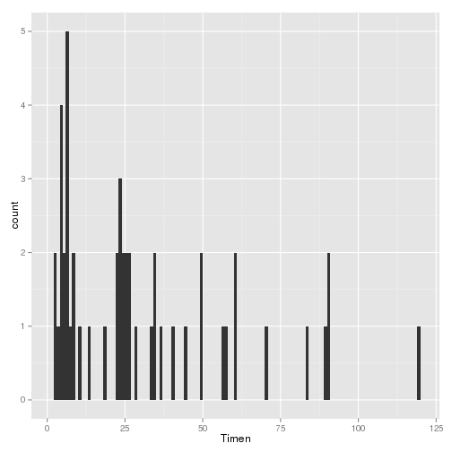
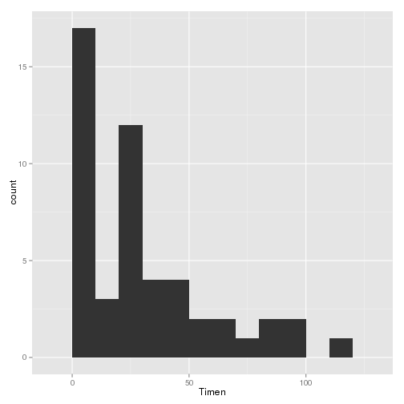
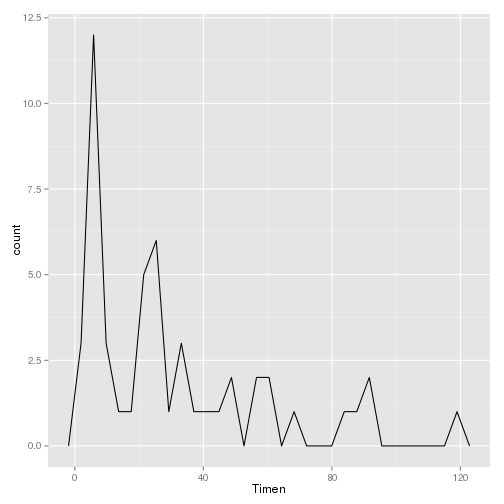
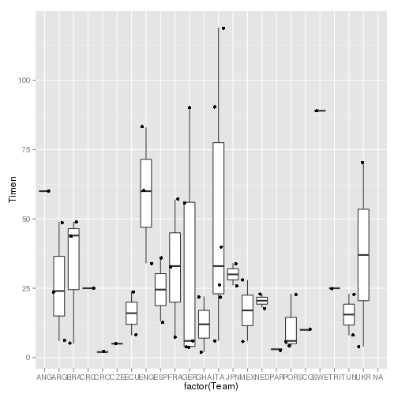
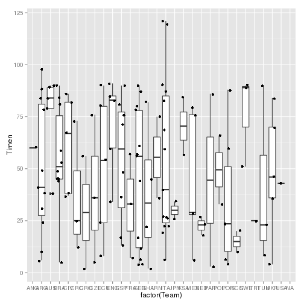
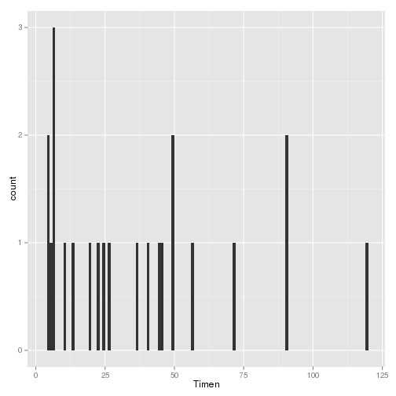
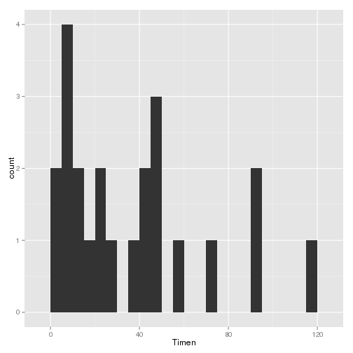
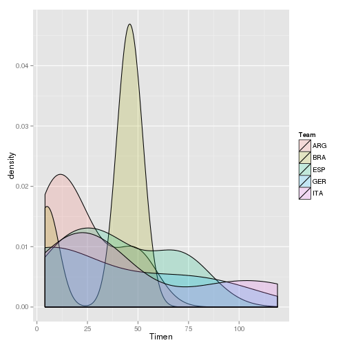
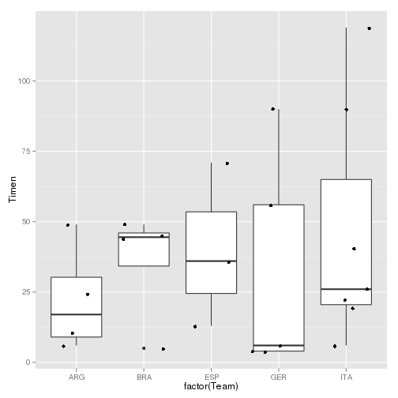
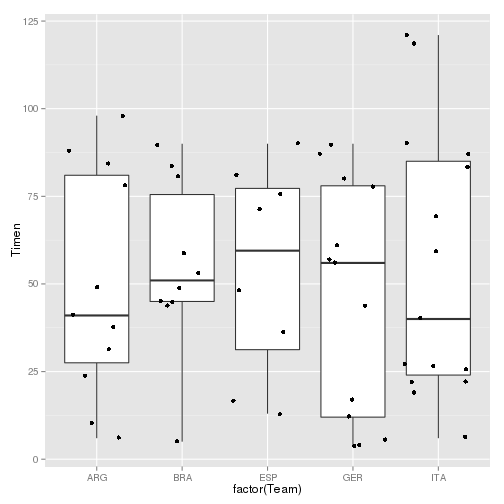

WorldCup2006
============

World Cup 2006 Score data and analysis

A set of R scripts to scrape the fifa website for the 2006 
games to produce stats of team scores.

Used as a topic dataset for a UK Maths school lesson

The following scripts scrape some data from the fifa website, process 
it and produce graphs.


```r
# source('/home/paul/workspace/world_cup/R/1_getData.R')
# source('/home/paul/workspace/world_cup/R/2_processData.R')
source("/home/paul/workspace/world_cup/R/3_producePlots.R")
```

 


here is a sample of the graphs


```r
qplot(Timen, data = firstgoal, geom = "histogram", binwidth = 10)
```

 

```r

qplot(Timen, data = firstgoal, geom = "freqpoly")
```

```
## stat_bin: binwidth defaulted to range/30. Use 'binwidth = x' to adjust
## this.
```

 

```r

qplot(factor(Team), Timen, data = firstgoal, geom = "boxplot") + geom_jitter()
```

```
## Warning: Removed 12 rows containing non-finite values (stat_boxplot).
```

```
## Warning: Removed 12 rows containing missing values (geom_point).
```

 

```r

qplot(factor(Team), Timen, data = world.cup.2006, geom = "boxplot") + geom_jitter()
```

```
## Warning: Removed 18 rows containing non-finite values (stat_boxplot).
```

```
## Warning: Removed 18 rows containing missing values (geom_point).
```

 

```r

qplot(Timen, data = top5firstgoal, geom = "histogram", binwidth = 1)
```

 

```r
qplot(Timen, data = top5firstgoal, geom = "histogram", binwidth = 5)
```

 

```r

ggplot(top5firstgoal, aes(Timen, fill = Team)) + geom_density(alpha = 0.2)
```

 

```r

qplot(factor(Team), Timen, data = top5firstgoal, geom = "boxplot") + geom_jitter()
```

 

```r

qplot(factor(Team), Timen, data = top5, geom = "boxplot") + geom_jitter()
```

 

```r

```


